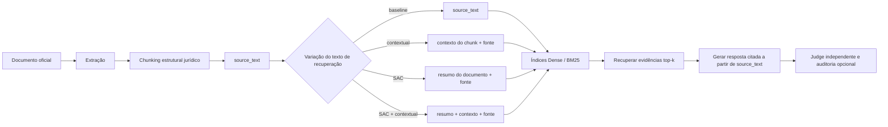

# Estratégias de recuperação e modelos auxiliares

[English](Retrieval-Strategies) · [Início](Home) · [Embeddings](Embeddings-pt-BR)

> Retrato da documentação em 2026-07-25. A configuração principal contém 10
> rótulos de estratégia. O README agrupa-os em oito famílias mais amplas; SAC e
> SAC+Contextual são variantes experimentais explícitas no runner.

## Visão de ponta a ponta



O chunker jurídico divide o texto pela hierarquia normativa — artigo,
parágrafo, inciso e alínea — e atribui um ID estrutural estável a cada unidade.
Nas variantes base, Contextual e SAC:

- `source_text` é extraído do documento oficial;
- `retrieval_text` pode conter contexto ou resumo gerado;
- a indexação usa `retrieval_text`;
- geração de resposta e citações usam `source_text`.

RAPTOR é a exceção que precisa permanecer explícita: ele cria nós sintéticos de
resumo cujo `source_text` é texto gerado. Esses nós podem entrar no contexto de
geração e carregam os IDs estruturais agregados dos filhos. Eles são uma abstração
para recuperação, não redação jurídica autoritativa.

## Matriz de estratégias

| Rótulo na configuração | Fonte dos candidatos | Ordenação | Embedding? | Trabalho adicional de modelo |
|---|---|---|---|---|
| `dense` | Chunks base | Similaridade cosseno no pgvector | Sim | Nenhum |
| `sparse_bm25` | Chunks base | BM25 no OpenSearch | Não | Nenhum |
| `hybrid_rrf` | Dense + BM25 | Reciprocal Rank Fusion | Sim, no ramo dense | Nenhum |
| `reranked` | Top 50 do Hybrid | Score do cross-encoder, depois top 5 | Sim, na primeira etapa | Cross-encoder local |
| `contextual` | Contexto por chunk + fonte | Hybrid RRF | Sim | Uma chamada Gemini por chunk |
| `parent_child` | Hits dense dos filhos | Score dense, depois expansão ao pai | Sim | Nenhum |
| `sac` | Resumo do documento + fonte | Similaridade cosseno Dense | Sim | Um resumo Gemini por documento |
| `sac_contextual` | Resumo + contexto do chunk + fonte | Similaridade cosseno Dense | Sim | Enriquecimento por documento e por chunk |
| `raptor` | Folhas + resumos recursivos | Similaridade cosseno Dense | Sim | Resumos Gemini para cada grupo da árvore |
| `graphrag` | Grafo e chunks do LightRAG | Ordem do LightRAG, mapeada para `1/rank` | Sim | Extração Gemini de entidades e relações |

O `top_k` padrão é 5, e o conjunto de reranking tem 50 candidatos.

## 1. Dense

Dense é o baseline semântico:

1. vetorizar o `retrieval_text` de cada chunk;
2. armazenar os vetores em uma coluna pgvector;
3. criar índice HNSW com `vector_cosine_ops`;
4. vetorizar a pergunta com o mesmo modelo;
5. devolver os `top_k` vetores mais próximos.

Pontos fortes:

- reconhece paráfrases e redações semanticamente relacionadas;
- não exige que os termos exatos da pergunta apareçam no chunk;
- serve de camada de recuperação para SAC e RAPTOR.

Trade-offs:

- a qualidade depende do modelo e da integração do embedding;
- identificadores exatos, números de artigo e termos raros podem ser perdidos;
- mudar o espaço vetorial exige reconstruir o índice.

## 2. Sparse BM25

`sparse_bm25` faz busca lexical no OpenSearch com o analisador `brazilian`.
BM25 ordena textos usando frequência do termo, frequência inversa no corpus e
normalização pelo tamanho do documento.

Pontos fortes:

- adequado para termos exatos, identificadores jurídicos, artigos e siglas;
- não tem custo de inferência de modelo;
- independe do embedding denso selecionado.

Trade-offs:

- paráfrases com pouca sobreposição lexical são mais difíceis;
- tokenização e análise linguística influenciam o resultado;
- é busca lexical clássica, não embedding sparse aprendido.

O índice sparse pesquisa `retrieval_text`, mas devolve o `source_text`
autoritativo associado.

## 3. Hybrid + RRF

Hybrid executa Dense e BM25 separadamente e combina suas posições com
Reciprocal Rank Fusion:

```text
RRF(chunk) = Σ 1 / (60 + rank)
```

Um chunk presente nos dois rankings acumula as duas contribuições. O RRF compara
posições em vez dos scores brutos, evitando comparar diretamente escalas
diferentes de BM25 e cosseno.

No RAGForge, cada ramo recebe a profundidade solicitada pelo chamador. No
`hybrid_rrf` comum, ela é top-k; dentro de `reranked`, ela é o conjunto maior de
reranking.

## 4. Reranked

A estratégia usa duas etapas:

```text
Top 50 do Hybrid
    -> cross-encoder(pergunta, chunk) para cada candidato
    -> ordenar pelo score do cross-encoder
    -> top 5
```

O modelo é `cross-encoder/ms-marco-MiniLM-L-6-v2`. Diferente de um
bi-encoder, o cross-encoder lê a pergunta e o chunk em conjunto, permitindo
interações mais finas entre seus tokens. Como é mais caro por candidato, ele
não é executado sobre todo o corpus.

Limitação importante: o modelo foi treinado para ranking de passagens MS MARCO,
e seu model card é orientado a inglês. Ele não foi selecionado pela comparação
dedicada de modelos em PT-BR. Seu desempenho em português jurídico brasileiro
precisa, portanto, de validação empírica.

## 5. Contextual Retrieval

Para cada chunk, `gemini-3.1-flash-lite` gera uma explicação curta que o situa
no documento-fonte completo:

```text
retrieval_text = contexto específico do chunk + source_text
```

O RAGForge indexa o texto enriquecido nos índices Dense e BM25 e recupera com
Hybrid+RRF. Assim, implementa contextual embeddings e contextual BM25.

Ponto forte:

- recupera informação perdida quando uma disposição jurídica não repete o
  assunto, a autoridade ou o escopo da norma.

Custos e riscos:

- uma chamada real de LLM por chunk durante a preparação do índice;
- o contexto gerado pode estar errado ou destacar demais uma interpretação;
- o contextualizador atual não usa o cache persistente de LLM empregado em
  algumas outras etapas; uma retomada pode repetir o trabalho;
- somente `source_text`, nunca o texto sintético, segue para a geração.

## 6. Parent-child

Parent-child, ou small-to-big, pesquisa chunks jurídicos detalhados e devolve um
pai autoritativo maior:

```text
pesquisar parágrafo/inciso -> devolver o artigo pai
```

A relação vem da hierarquia jurídica real produzida pelo chunker, não de uma
janela arbitrária de caracteres. Pais duplicados são removidos. Quando vários
filhos bem posicionados têm o mesmo pai, a estratégia pode devolver menos de
`top_k`, pois não repõe resultados após a deduplicação.

A implementação atual usa Dense — não Hybrid — como retriever interno.

## 7. Summary-Augmented Chunking (SAC)

SAC gera um resumo para cada versão imutável de documento com
`gemini-3.1-flash-lite` e prefixa o mesmo resumo em todos os chunks daquele
documento:

```text
retrieval_text = resumo do documento + source_text
```

O objetivo é reduzir Document-Level Retrieval Mismatch: recuperar uma cláusula
localmente plausível da norma errada. O rótulo `sac` usa Dense para isolar o
efeito do resumo do documento.

Trade-offs:

- uma chamada de geração por documento, em vez de uma por chunk;
- pode melhorar a discriminação entre documentos;
- um erro no resumo se repete em todos os chunks do documento;
- o prefixo comum pode reduzir a discriminação entre disposições da mesma norma;
- SAC continua experimental até demonstrar ganho em mais de uma família de
  embedding sem regressão material no recall estrutural.

## 8. SAC + Contextual

A composição preserva os dois níveis de contexto:

```text
retrieval_text =
    resumo do documento
    + contexto específico do chunk
    + source_text
```

Ela reutiliza os chunks já contextualizados e aplica o resumo do documento por
cima. Em seguida, usa Dense. Rótulo e fingerprint próprios impedem que o
resultado seja apresentado como Dense comum ou SAC isolado.

## 9. RAPTOR

RAPTOR adiciona nós recursivamente resumidos acima dos chunks originais e
pesquisa todos os níveis juntos, no modo “collapsed tree”.

A implementação do RAGForge é deliberadamente mínima:

- agrupa nós na ordem do documento, cinco por vez;
- resume cada grupo com `gemini-3.1-flash-lite`;
- repete até cinco níveis ou até chegar a uma raiz;
- constrói uma árvore separada por documento;
- reúne folhas e resumos em um único índice Dense.

Esse **não** é o algoritmo completo do artigo RAPTOR. Não há redução UMAP nem
clustering semântico por mistura gaussiana. Artigos adjacentes, mas de assuntos
diferentes, podem ser resumidos juntos, e os nós de resumo gerados são
devolvidos como conteúdo recuperado. Como esses nós armazenam o resumo gerado em
`source_text`, eles também podem chegar ao gerador de resposta; os IDs estruturais
dos filhos não tornam a redação gerada autoritativa. A simplificação e esse risco
para a qualidade da evidência devem permanecer explícitos nas comparações.

## 10. GraphRAG

O RAGForge integra o LightRAG:

1. preserva os limites dos chunks jurídicos pelo ponto de extensão de chunking
   do LightRAG;
2. usa o embedding de recuperação configurado para os vetores do LightRAG;
3. usa `gemini-3.1-flash-lite` para extrair entidades e relações;
4. consulta no modo `local` por padrão;
5. relaciona o conteúdo devolvido aos chunks do RAGForge por texto exato.

Limitações atuais:

- o mapeamento por texto exato pode descartar resultados reformatados ou sem
  correspondência;
- o LightRAG não expõe score nativo por chunk nesse caminho; o RAGForge registra
  `1/rank`;
- caminhos do grafo, confiança das entidades e proveniência das relações não
  entram na métrica de recuperação;
- a indexação faz várias chamadas de LLM por chunk e tem custo bem maior;
- os modos `global`, `hybrid`, `mix` e `naive` são aceitos pelo adaptador, mas
  o benchmark principal fixa `local`.

Temporal GraphRAG é uma estratégia futura e separada. Ela não está na matriz
atual porque o corpus ainda não possui evidência temporal com versões
qualificadas.

## Modelos auxiliares: o que é e o que não é embedding

| Etapa | Modelo | Papel | Embedding de recuperação? |
|---|---|---|---|
| Indexação/consulta Dense | Modelo Gemini ou local configurado | Produzir vetores de recuperação | Sim |
| Reranking | `cross-encoder/ms-marco-MiniLM-L-6-v2` | Avaliar pares pergunta–chunk em conjunto | Não |
| Contextual Retrieval | `gemini-3.1-flash-lite` | Gerar contexto específico por chunk | Não |
| SAC | `gemini-3.1-flash-lite` | Gerar um resumo por versão de documento | Não |
| RAPTOR | `gemini-3.1-flash-lite` | Gerar nós de resumo recursivos | Não |
| Extração do GraphRAG | `gemini-3.1-flash-lite` | Extrair entidades e relações | Não |
| Geração de resposta | `gemini-3.1-flash-lite` configurado | Produzir resposta com citações | Não |
| Judge canônico | `gpt-5.4-mini-2026-03-17` | Medir fidelidade, relevância e abstenção | Não |
| Relevância do judge | `text-embedding-3-small` | Apoiar Answer Relevancy do RAGAS | Sim, mas somente para avaliação |
| Auditoria semântica opcional | `gpt-5.4-mini-2026-03-17` | Verificar suporte e reescrever no máximo uma vez | Não |

O judge canônico é independente do gerador Gemini, mas seus scores continuam
sem validação até que o exercício planejado de calibração humana atinja a
concordância exigida.

## Quais provedores são contatados?

| Comando | Embedding de recuperação | Outros provedores live |
|---|---|---|
| `make bench-live` | Gemini | Geração/enriquecimento Gemini + judge OpenAI |
| `make bench-live-local` | Qwen local | Geração/enriquecimento Gemini + judge OpenAI |
| `make bench` | Replay por cache pretendido | Não implementado; o comando falha de forma explícita |

Portanto, `make bench-live-local` não é um benchmark offline. Ele remove o
provedor externo apenas da etapa de embedding de recuperação.

## Avaliação

As estratégias compartilham julgamentos por unidade estrutural e produzem:

- Recall@k;
- Precision@k;
- nDCG@k;
- MRR;
- métricas de mismatch no nível de documento para variantes aplicáveis;
- cobertura e falhas.

A geração de resposta é avaliada separadamente por Citation Accuracy,
Faithfulness, Answer Relevancy e comportamento de abstenção. Uma estratégia
pode recuperar bem e ainda gerar resposta ruim; as duas camadas não devem ser
reduzidas a um score único sem definição.

## Fontes

### RAGForge

- [Runner principal do benchmark](https://github.com/brunovicco/ragforge/blob/main/src/ragforge/evaluation/run.py)
- [Implementações de recuperação](https://github.com/brunovicco/ragforge/tree/main/src/ragforge/retrieval)
- [ADR-0006: chunking estrutural jurídico](https://github.com/brunovicco/ragforge/blob/main/docs/adr/0006-legal-structural-chunker.md)
- [ADR-0010: escopo do GraphRAG](https://github.com/brunovicco/ragforge/blob/main/docs/adr/0010-graphrag-evaluation-scope.md)
- [ADR-0015: SAC](https://github.com/brunovicco/ragforge/blob/main/docs/adr/0015-summary-augmented-chunking.md)

### Referências primárias

- [OpenSearch: busca BM25](https://docs.opensearch.org/latest/search-plugins/keyword-search/)
- [OpenSearch: Reciprocal Rank Fusion](https://docs.opensearch.org/latest/search-plugins/search-pipelines/score-ranker-processor/)
- [Anthropic: Contextual Retrieval](https://www.anthropic.com/engineering/contextual-retrieval)
- [Artigo RAPTOR](https://arxiv.org/abs/2401.18059)
- [Artigo SAC](https://aclanthology.org/2025.nllp-1.3/)
- [Repositório LightRAG](https://github.com/HKUDS/LightRAG)
- [Model card do cross-encoder](https://huggingface.co/cross-encoder/ms-marco-MiniLM-L-6-v2)
