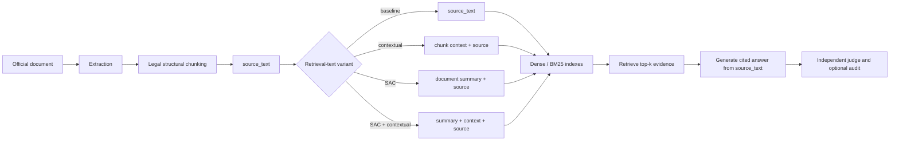

# Retrieval strategies and supporting models

[Português](Estrategias-de-Recuperacao) · [Home](Home) · [Embeddings](Embeddings)

> Documentation snapshot: 2026-07-25. The main configuration contains 10
> strategy labels. The project README groups them into eight broader families;
> SAC and SAC+Contextual are explicit experimental variants in the runner.

## End-to-end view



The legal structural chunker splits by normative hierarchy—article, paragraph,
item, and sub-item—and gives each unit a stable structural ID. For the base,
Contextual, and SAC variants:

- `source_text` is extracted from the official document;
- `retrieval_text` may contain generated context or summaries;
- indexing uses `retrieval_text`;
- answer generation and citations use `source_text`.

RAPTOR is the exception that must remain explicit: it creates synthetic summary
nodes whose `source_text` is generated text. Those nodes can enter answer-generation
context and carry the aggregated structural IDs of their children. They provide a
retrieval abstraction, not authoritative legal wording.

## Strategy matrix

| Configuration label | Candidate source | Ranking | Embedding? | Extra model work |
|---|---|---|---|---|
| `dense` | Base chunks | pgvector cosine similarity | Yes | None |
| `sparse_bm25` | Base chunks | OpenSearch BM25 | No | None |
| `hybrid_rrf` | Dense + BM25 | Reciprocal Rank Fusion | Yes, on dense branch | None |
| `reranked` | Hybrid top 50 | Cross-encoder score, then top 5 | Yes, during first stage | Local cross-encoder |
| `contextual` | Per-chunk context + source | Hybrid RRF | Yes | One Gemini context call per chunk |
| `parent_child` | Dense child hits | Dense score, then parent expansion | Yes | None |
| `sac` | Document summary + source | Dense cosine similarity | Yes | One Gemini summary per document |
| `sac_contextual` | Summary + chunk context + source | Dense cosine similarity | Yes | Document and chunk enrichment |
| `raptor` | Leaves + recursive summaries | Dense cosine similarity | Yes | Gemini summaries for each tree group |
| `graphrag` | LightRAG graph and chunks | LightRAG order, mapped to `1/rank` | Yes | Gemini entity/relation extraction |

The default `top_k` is 5, and the reranking pool is 50.

## 1. Dense

Dense retrieval is the semantic baseline:

1. embed every chunk's `retrieval_text`;
2. store vectors in a pgvector column;
3. build an HNSW index using `vector_cosine_ops`;
4. embed the question with the same model;
5. return the nearest `top_k` vectors.

Strengths:

- recognizes paraphrases and semantically related wording;
- does not require exact query terms to occur in the chunk;
- is reusable as the retrieval layer for SAC and RAPTOR.

Trade-offs:

- quality depends on the embedding model and integration;
- exact identifiers, article numbers, and rare terms may be missed;
- changing the embedding space requires rebuilding the index.

## 2. Sparse BM25

`sparse_bm25` performs lexical retrieval in OpenSearch with the `brazilian`
analyzer. BM25 ranks text using term frequency, inverse document frequency, and
document-length normalization.

Strengths:

- effective for exact terms, legal identifiers, article numbers, and acronyms;
- has no model inference cost;
- is independent from the selected dense embedding.

Trade-offs:

- semantic paraphrases with little lexical overlap are harder to find;
- tokenization and language analysis affect results;
- this is classical lexical search, not a learned sparse embedding.

The sparse store searches `retrieval_text` but returns the associated
authoritative `source_text`.

## 3. Hybrid + RRF

Hybrid retrieval runs Dense and BM25 independently, then combines their ranks
with Reciprocal Rank Fusion:

```text
RRF(chunk) = Σ 1 / (60 + rank)
```

A chunk appearing in both rankings accumulates both contributions. RRF compares
ranks instead of raw scores, avoiding a direct comparison between BM25 and cosine
score scales.

In RAGForge, each branch is asked for the same candidate depth requested by the
caller. For ordinary `hybrid_rrf` that is top-k; for the reranked strategy it is
the wider rerank pool.

## 4. Reranked

The reranked strategy is a two-stage pipeline:

```text
Hybrid top 50
    -> cross-encoder(query, chunk) for every candidate
    -> sort by cross-encoder score
    -> top 5
```

The model is `cross-encoder/ms-marco-MiniLM-L-6-v2`. Unlike a bi-encoder, a
cross-encoder jointly reads the question and chunk, enabling finer interaction
between their tokens. It is more expensive per candidate, so it is not run over
the whole corpus.

Important limitation: the model was trained for MS MARCO passage ranking and its
model card is English-oriented. It was not selected through the project's
dedicated PT-BR model comparison. Its performance on Brazilian legal Portuguese
therefore needs empirical validation.

## 5. Contextual Retrieval

For every chunk, `gemini-3.1-flash-lite` generates a short explanation that
locates it within the complete source document:

```text
retrieval_text = chunk-specific context + source_text
```

RAGForge then indexes the enriched text in both Dense and BM25 stores and
retrieves with Hybrid+RRF. This implements both contextual embeddings and
contextual BM25.

Strength:

- restores information lost when a legal provision does not repeat the norm's
  subject, authority, or scope.

Costs and risks:

- one real LLM call per chunk during index preparation;
- generated context can be wrong or overemphasize one interpretation;
- the current contextualizer is not wired to the persistent LLM cache used by
  some other stages, so resume can repeat this work;
- only `source_text`, never the generated blurb, is sent to answer generation.

## 6. Parent-child

Parent-child, or small-to-big retrieval, searches fine-grained legal chunks and
returns a larger authoritative parent:

```text
search paragraph/item -> return its parent article
```

The relationship comes from the real legal hierarchy produced by the chunker,
not an arbitrary character window. Duplicate parents are removed. If several
high-ranked children share a parent, the strategy can return fewer than
`top_k` results because it does not backfill after deduplication.

The current implementation uses Dense—not Hybrid—as its inner retriever.

## 7. Summary-Augmented Chunking (SAC)

SAC generates one summary for each immutable document version with
`gemini-3.1-flash-lite`, then prefixes the same summary to every chunk from that
document:

```text
retrieval_text = document summary + source_text
```

It targets Document-Level Retrieval Mismatch: finding a locally plausible clause
from the wrong norm. The `sac` label uses Dense retrieval to isolate the effect
of the document summary.

Trade-offs:

- one generation call per document rather than per chunk;
- the summary can improve document discrimination;
- one summary error is repeated across every chunk in that document;
- the common prefix can weaken within-document discrimination;
- SAC remains experimental until improvement is measured across embedding
  families without a material structural-recall regression.

## 8. SAC + Contextual

This composition preserves both levels of context:

```text
retrieval_text =
    document summary
    + chunk-specific context
    + source_text
```

It reuses the already contextualized chunks and applies the document summary on
top. The strategy then uses Dense retrieval. A distinct strategy label and index
fingerprint prevent the result from being reported as ordinary Dense or SAC.

## 9. RAPTOR

RAPTOR adds recursively summarized nodes above the original chunks and searches
all levels together—the “collapsed tree” mode.

The RAGForge implementation is intentionally minimal:

- groups nodes in source-document order, five at a time;
- summarizes each group with `gemini-3.1-flash-lite`;
- repeats up to five levels or until one root remains;
- builds a separate tree per document;
- flattens leaves and summaries into one Dense index.

This is **not** the full RAPTOR paper algorithm. It does not apply UMAP reduction
or Gaussian-mixture semantic clustering. Adjacent but topically different
articles can be summarized together, and generated summary nodes are returned as
retrieval content. Because those nodes store the generated summary as
`source_text`, they can also reach the answer generator; their child structural
IDs do not make the generated wording authoritative. The simplification and this
evidence-quality risk must remain visible in comparisons.

## 10. GraphRAG

RAGForge integrates LightRAG:

1. preserve the project's legal chunk boundaries through LightRAG's custom
   chunking extension;
2. use the configured retrieval embedder for LightRAG vectors;
3. use `gemini-3.1-flash-lite` for entity and relation extraction;
4. query in LightRAG `local` mode by default;
5. map returned chunk content back to RAGForge chunks by exact text matching.

Current limitations:

- exact-text mapping can drop results that LightRAG reformats or cannot match;
- LightRAG exposes no native per-chunk relevance score in this path, so RAGForge
  records `1/rank`;
- graph paths, entity confidence, and relationship provenance are not included
  in the retrieval metric;
- indexing makes multiple LLM calls per chunk and is materially more expensive;
- `global`, `hybrid`, `mix`, and `naive` modes are accepted by the adapter, but
  the main benchmark fixes `local`.

Temporal GraphRAG is a future, separate strategy. It is not implemented in the
current matrix because the corpus does not yet have version-qualified temporal
evidence.

## Supporting models: what is and is not an embedding

| Stage | Model | Role | Retrieval embedding? |
|---|---|---|---|
| Dense indexing/query | Configured Gemini or local model | Produce retrieval vectors | Yes |
| Reranking | `cross-encoder/ms-marco-MiniLM-L-6-v2` | Jointly score query–chunk pairs | No |
| Contextual Retrieval | `gemini-3.1-flash-lite` | Generate chunk-specific context | No |
| SAC | `gemini-3.1-flash-lite` | Generate one summary per document version | No |
| RAPTOR | `gemini-3.1-flash-lite` | Generate recursive summary nodes | No |
| GraphRAG extraction | `gemini-3.1-flash-lite` | Extract entities and relations | No |
| Answer generation | Configured `gemini-3.1-flash-lite` | Produce a cited answer | No |
| Canonical judge | `gpt-5.4-mini-2026-03-17` | Score faithfulness, relevancy, and abstention | No |
| Judge relevancy | `text-embedding-3-small` | Support RAGAS Answer Relevancy | Yes, but evaluation-only |
| Optional semantic audit | `gpt-5.4-mini-2026-03-17` | Verify claim support and rewrite once | No |

The canonical judge is independent from the Gemini answer generator, but its
scores remain unvalidated until the planned human-calibration exercise reaches
the required agreement.

## Which providers are contacted?

| Command | Retrieval embedding | Other live providers |
|---|---|---|
| `make bench-live` | Gemini | Gemini generation/enrichment + OpenAI judge |
| `make bench-live-local` | Local Qwen | Gemini generation/enrichment + OpenAI judge |
| `make bench` | Intended cache replay | Not implemented; the command currently fails closed |

Therefore, `make bench-live-local` is not an offline benchmark. It only removes
the external provider from the retrieval-embedding stage.

## Evaluation

Retrieval strategies share structural-unit judgments and report:

- Recall@k;
- Precision@k;
- nDCG@k;
- MRR;
- document-level mismatch metrics for relevant variants;
- coverage and failures.

Answer generation is evaluated separately for Citation Accuracy, Faithfulness,
Answer Relevancy, and abstention behavior. A strategy can retrieve well and
still produce a poor answer; the two layers should not be collapsed into one
undocumented score.

## Sources

### RAGForge

- [Main benchmark runner](https://github.com/brunovicco/ragforge/blob/main/src/ragforge/evaluation/run.py)
- [Retrieval implementations](https://github.com/brunovicco/ragforge/tree/main/src/ragforge/retrieval)
- [ADR-0006: legal structural chunking](https://github.com/brunovicco/ragforge/blob/main/docs/adr/0006-legal-structural-chunker.md)
- [ADR-0010: GraphRAG scope](https://github.com/brunovicco/ragforge/blob/main/docs/adr/0010-graphrag-evaluation-scope.md)
- [ADR-0015: SAC](https://github.com/brunovicco/ragforge/blob/main/docs/adr/0015-summary-augmented-chunking.md)

### Primary references

- [OpenSearch: BM25 keyword search](https://docs.opensearch.org/latest/search-plugins/keyword-search/)
- [OpenSearch: Reciprocal Rank Fusion](https://docs.opensearch.org/latest/search-plugins/search-pipelines/score-ranker-processor/)
- [Anthropic: Contextual Retrieval](https://www.anthropic.com/engineering/contextual-retrieval)
- [RAPTOR paper](https://arxiv.org/abs/2401.18059)
- [SAC paper](https://aclanthology.org/2025.nllp-1.3/)
- [LightRAG repository](https://github.com/HKUDS/LightRAG)
- [Cross-encoder model card](https://huggingface.co/cross-encoder/ms-marco-MiniLM-L-6-v2)
